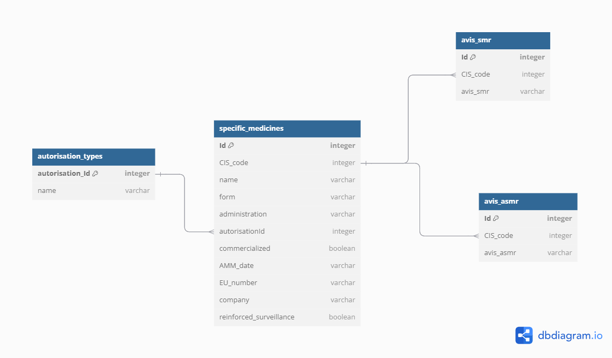

[![Contributors][contributors-shield]][contributors-url]
[![Forks][forks-shield]][forks-url]
[![Stargazers][stars-shield]][stars-url]
[![Issues][issues-shield]][issues-url]


<!-- PROJECT LOGO -->
<br />
<div align="center">
  <a>
    
  </a>

<h3 align="center">MedicoCompare API</h3>

  <p align="center">
        API de l'application MedicoCompare qui permet de récupérer l'intégralité des médicaments et leurs informations associées
    <br />
    <a href="https://github.com/Dolu13/medico-compare-back/issues/new">Report un Bug</a>
    ·
    <a href="https://github.com/Dolu13/medico-compare-back/issues/new">Demande de fonctionnalité</a>
  </p>
</div>


<!-- TABLE OF CONTENTS -->
<details>
  <summary>Sommaire</summary>
  <ol>
    <li>
      <a href="#about-the-project">A propos du projet</a>
      <ul>
        <li><a href="#built-with">Stack technique</a></li>
      </ul>
    </li>
    <li>
      <a href="#getting-started">Allons-y</a>
      <ul>
        <li><a href="#prerequisites">Prérequis</a></li>
        <li><a href="#installation">Installation</a></li>
        <li><a href="#lancement">Lancement</a></li>

      </ul>
    </li>
    <li><a href="#usage">Diagrammes de séquence</a></li>
    <li><a href="#roadmap">Difficultés techniques</a></li>
    <li><a href="#contributing">Axes d'améliorations</a></li>
    <li><a href="#acknowledgments">Remerciements et Crédits</a></li>
  </ol>
</details>


<!-- ABOUT THE PROJECT -->
## A propos du projet

Notre projet est un site web qui permet de rechercher un médicament pour informer l'utilisateur concernant ses caractéristiques. Il fournit le moyen d'administration, le groupe pharmaceutique, et les avis SMR et ASMR de la HAS (Haute Autorité de Santé) du médicament.

Tester l'API [ici](https://medico-compare-back.vercel.app/).

<p align="right">(<a href="#readme-top">back to top</a>)</p>


### Stack technique


* [![Javascript][javascript]][javascript-url]
* [![Mysql][mysql]][mysql-url]
* [![Prisma][prisma]][prisma-url]
* [![Node][node.js]][node-url]
* [![Express][express]][express-url]
* [![TypeScript][typescript]][typescript-url]


<p align="right">(<a href="#readme-top">back to top</a>)</p>


<!-- GETTING STARTED -->

### Prérequis


Assurrez vous d'avoir node.js installez sur votre machine.

### Installation

Après avoir clone le repo

1. 
   ```sh
   git clone https://github.com/Dolu13/medico-compare-back.git
   ```
2. Lancez votre IDE favori, ouvrez un terminal dans le dossier du repo et lancez l'installation des dépendances
   ```sh
   npm install
   ```

### Lancement

1. Mettez a jour la variable `DATABASE_URL` qui se trouve dans le fichier `.env` avec la chaine de connection à votre base MySql

2. Synchronisez votre base de donnée grâce a prisma en exécutant la commande suivante
   ```sh
   npx prisma db push
   ```
3. Enfin, lancez le serveur grâce à :
   ```sh
   npm start
   ```
Vous n'avez plus qu'a ouvrir un navigateur et consulter le port qui a été utilisé. (par défaut `3000`)

<p align="right">(<a href="#readme-top">back to top</a>)</p>


### Modèle Physique de Données



#### Provenance des données

Les jeux de données insérés dans notre base proviennent du site https://www.data.gouv.fr/fr/pages/donnees_sante/


<p align="right">(<a href="#readme-top">back to top</a>)</p>

<!-- CONTRIBUTING -->

## Axes d'améliorations


- [ ] Optimisation des performances pour l'insertion des données
  - [ ] scripting avancé
- [ ] Aspect sécurité : se pencher sur la protection contre les attaques (DDOS, injection SQL...)
- [ ] Nouvelles fonctionalitées
    - [ ] Savoir si un médicament est disponible ou non.

<!-- CONTACT -->
## Contact

Contact :<br>
ludovic.demol@ecoles-epsi.net<br>


<p align="right">(<a href="#readme-top">back to top</a>)</p>


<!-- MARKDOWN LINKS & IMAGES -->
<!-- https://www.markdownguide.org/basic-syntax/#reference-style-links -->
[contributors-shield]: https://img.shields.io/github/contributors/othneildrew/Best-README-Template.svg?style=for-the-badge
[contributors-url]: https://github.com/Dolu13/medico-compare-back/graphs/contributors
[forks-shield]: https://img.shields.io/github/forks/othneildrew/Best-README-Template.svg?style=for-the-badge
[forks-url]: https://github.com/Dolu13/medico-compare-back/network/members
[stars-shield]: https://img.shields.io/github/stars/othneildrew/Best-README-Template.svg?style=for-the-badge
[stars-url]: https://github.com/Dolu13/medico-compare-back/stargazers
[issues-shield]: https://img.shields.io/github/issues/othneildrew/Best-README-Template.svg?style=for-the-badge
[issues-url]: https://github.com/Dolu13/medico-compare-back/issues


[node.js]: https://img.shields.io/badge/Node.js-43853D?style=for-the-badge&logo=node.js&logoColor=white
[javascript]: https://img.shields.io/badge/JavaScript-323330?style=for-the-badge&logo=javascript&logoColor=F7DF1E
[typescript]: https://img.shields.io/badge/TypeScript-007ACC?style=for-the-badge&logo=typescript&logoColor=white
[express]: https://img.shields.io/badge/Express%20js-000000?style=for-the-badge&logo=express&logoColor=white
[prisma]: https://img.shields.io/badge/Prisma-3982CE?style=for-the-badge&logo=Prisma&logoColor=white
[mysql]: https://shields.io/badge/MySQL-lightgrey?logo=mysql&style=plastic&logoColor=white&labelColor=blue


[node-url]: https://nodejs.org/en
[javascript-url]: https://developer.mozilla.org/fr/docs/Web/JavaScript
[typescript-url]: https://www.typescriptlang.org
[express-url]: https://expressjs.com/
[prisma-url]: https://www.prisma.io/
[mysql-url]: https://www.mysql.com/fr/
